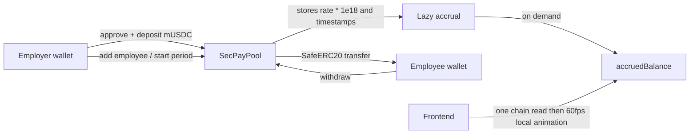

# SecPay — real-time wages on Base

SecPay is a non-custodial payroll demo for the East African wage-access problem: workers can withdraw the portion of their salary they have already earned instead of waiting for the next 30-day pay date. An employer funds one ERC-20 payroll pool; each worker’s earned amount is calculated lazily when it is viewed or withdrawn. No per-second transactions are made.

> Status: the full source, tests, deployment scripts, and frontend are included. This workspace did not contain Foundry, an RPC endpoint, or a funded Base Sepolia deployer at build time, so the addresses below intentionally remain pending rather than claiming a deployment that did not occur.

## Architecture



`SecPayPool` accepts an ERC-20 address at deployment, so replacing mUSDC with Base USDC is a deployment configuration change. A 30-day period is 2,592,000 seconds. Rates are stored at 1e18 precision and any normal period-end division remainder is paid to the employee. The contract maintains a reservation ledger so an employer may only reclaim true surplus, never funds reserved for workers.

## Project layout

```
contracts/    Foundry source, tests, scripts
frontend/     Next.js 14 App Router app
.env.example  required contract and frontend configuration
```

## Setup

1. Copy `.env.example` to `.env` and set `BASE_SEPOLIA_RPC_URL`, `PRIVATE_KEY`, and `NEXT_PUBLIC_WALLETCONNECT_PROJECT_ID`. Never commit this file.
2. Install Foundry (Windows users can use the official Foundry installer) and dependencies:

   ```powershell
   cd contracts
   forge install foundry-rs/forge-std OpenZeppelin/openzeppelin-contracts --no-commit
   forge test -vvv
   ```

3. Deploy mUSDC and SecPayPool, then sync the addresses into the frontend:

   ```powershell
   cd contracts
   .\script\deploy-and-sync.ps1
   ```

   The script records addresses at `contracts/deployments/base-sepolia.json`. To re-sync an existing deployment, set `SECPAY_POOL_ADDRESS` and `MOCK_USDC_ADDRESS` from that file and run:

   ```powershell
   forge script script/SyncFrontend.s.sol:SyncFrontend
   ```

4. Add the same two values as `NEXT_PUBLIC_SECPAY_POOL_ADDRESS` and `NEXT_PUBLIC_MOCK_USDC_ADDRESS` in `frontend/.env.local`, then run the web app:

   ```powershell
   cd frontend
   npm install
   npm run dev
   ```

Set `NEXT_PUBLIC_BASE_MAINNET=true` and use the mainnet SecPay deployment plus the canonical Base USDC address when promoting to Base mainnet. Vercel only needs the `NEXT_PUBLIC_*` variables above.

## Three-minute demo

1. Connect an employer wallet on Base Sepolia and click **Get test mUSDC**.
2. Create a pool, add an employee wallet, enter a monthly mUSDC salary, approve/deposit the required amount, and start the period.
3. Switch to the employee wallet. Its earned amount starts ticking in the dashboard; click **Withdraw** to send the accrued mUSDC immediately to that wallet.

## Base Sepolia deployment

| Contract | Address | Explorer |
|---|---|---|
| MockUSDC | `0x42cb796103e7D67f0d585978d48749855a83f13e` | [BaseScan](https://sepolia.basescan.org/address/0x42cb796103e7D67f0d585978d48749855a83f13e) |
| SecPayPool | `0xaE3b32c10947ED6c2d12bAA2b247A24E67984088` | [BaseScan](https://sepolia.basescan.org/address/0xaE3b32c10947ED6c2d12bAA2b247A24E67984088) |

After `deploy-and-sync.ps1` completes, replace this table with the exact `https://sepolia.basescan.org/address/<address>` links produced by the deployment. This keeps the README honest and makes the deployment record reviewable.

## Contract behavior and safety

- `withdraw` and `withdrawSurplus` are `nonReentrant`; all ERC-20 actions use `SafeERC20`.
- A paused pool excludes the pause from virtual accrual time; no worker earns during the pause.
- Removing a worker settles and freezes their already earned balance, which remains withdrawable.
- Salary changes settle earnings at the old rate before applying the new rate. Raising a salary requires enough additional pool balance to cover the revised liability.
- The test suite covers lifecycle, exact-period/dust behavior, withdrawal, pause/removal/update cases, privilege boundaries, surplus protection, and fuzzed accrual bounds.
