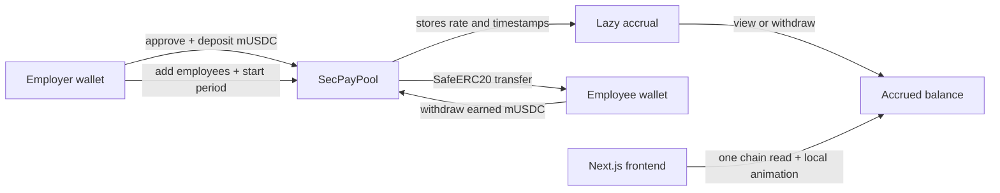

# SecPay — real-time wages on Base

SecPay is a non-custodial wage-streaming dApp for workers who need access to earnings before a monthly payday. An employer funds a 30-day ERC-20 payroll pool; employees accrue a visible balance every second and can withdraw only what they have earned, directly to their wallet.

The prototype focuses on the East African wage-access problem: instant liquidity for earned wages, without asking an employer to make a transfer every second or giving a third party custody of payroll funds.

## Live Base Sepolia contracts

| Contract | Address | Explorer |
|---|---|---|
| MockUSDC (mUSDC) | `0x42cb796103e7D67f0d585978d48749855a83f13e` | [BaseScan](https://sepolia.basescan.org/address/0x42cb796103e7D67f0d585978d48749855a83f13e) |
| SecPayPool | `0xaE3b32c10947ED6c2d12bAA2b247A24E67984088` | [BaseScan](https://sepolia.basescan.org/address/0xaE3b32c10947ED6c2d12bAA2b247A24E67984088) |

> These are testnet contracts. mUSDC has no value. Never put a private key, seed phrase, or production funds in this repository.

## How it works



No on-chain transfer happens every second. The contract records each employee's scaled rate and calculates the amount owed only when it is read or withdrawn. The UI animates that already-verifiable rate locally, then re-syncs on transactions and when the browser regains focus.

## Key design decisions

- **Lazy accrual:** avoids impractical per-second transactions while retaining per-second earning semantics.
- **30-day fixed period:** a pay period is 2,592,000 seconds. This makes monthly obligations predictable for the employer.
- **Precision and dust:** rates are stored at 1e18 precision; the employee receives any rounding remainder at period end.
- **Reserved payroll funds:** surplus withdrawal is limited to funds not reserved for employees, so an employer cannot reclaim earned or promised payroll.
- **Stops, edits, and pauses:** removing a worker freezes their already-earned balance; salary changes settle the old rate first; pausing excludes paused time from accrual.
- **ERC-20 abstraction:** SecPayPool accepts its payment token in the constructor. MockUSDC is used on Base Sepolia; production USDC is a deployment/configuration change, not a contract rewrite.

## Project structure

```
contracts/                  Foundry contracts, tests, deployment and sync scripts
  src/SecPayPool.sol         Payroll pool contract
  src/MockUSDC.sol           Six-decimal test token with an hourly faucet
  test/SecPayPool.t.sol      Lifecycle, access control, precision and fuzz tests
  deployments/               Recorded Base Sepolia addresses
frontend/                   Next.js 14 App Router client
  src/app/                   Landing, role selection and dashboards
  src/contracts/             Frontend ABI and deployment address helpers
.env.example                Root environment-variable template
```

## Prerequisites

- Node.js 20 or newer
- npm
- Foundry (`forge`, `cast`)
- A browser wallet (MetaMask, Coinbase Wallet, or WalletConnect-compatible wallet)
- A Base Sepolia RPC URL and a wallet with small amount of Base Sepolia ETH only when deploying contracts

## Local setup

### 1. Clone and configure secrets

```bash
git clone https://github.com/kida256-glitch/secpay.git
cd secpay
Copy-Item .env.example .env
notepad .env
```

Set these root `.env` values only if you intend to deploy contracts:

```
BASE_SEPOLIA_RPC_URL=https://your-base-sepolia-rpc-url
PRIVATE_KEY=0xyour_deployer_private_key
ETHERSCAN_API_KEY=optional
```

`PRIVATE_KEY` must begin with `0x`. Keep `.env` private; it is ignored by Git.

### 2. Install contract dependencies and test

```bash
cd contracts
forge install foundry-rs/forge-std OpenZeppelin/openzeppelin-contracts --no-commit
forge test -vvv
```

The Foundry suite covers pool creation, exact accrual, sequential withdrawals, full-month dust handling, employee removal, salary changes, pause/resume, privilege boundaries, reentrancy protection, and fuzzed time/salary inputs.

### 3. Run the frontend

Create `frontend/.env.local`:

```
NEXT_PUBLIC_SECPAY_POOL_ADDRESS=0xaE3b32c10947ED6c2d12bAA2b247A24E67984088
NEXT_PUBLIC_MOCK_USDC_ADDRESS=0x42cb796103e7D67f0d585978d48749855a83f13e
NEXT_PUBLIC_WALLETCONNECT_PROJECT_ID=your_walletconnect_project_id
NEXT_PUBLIC_BASE_MAINNET=false
```

Then start the app:

```bash
cd frontend
npm.cmd install
npm.cmd run dev
```

Open http://localhost:3000. `npm.cmd` avoids Windows PowerShell execution-policy blocks that can affect `npm.ps1`.

## Deploy contracts to Base Sepolia

Fund the deployer wallet with Base Sepolia ETH, set the root `.env` values above, then run:

```bash
cd contracts
powershell.exe -ExecutionPolicy Bypass -File .\script\deploy-and-sync.ps1
```

The script deploys MockUSDC and SecPayPool, writes `contracts/deployments/base-sepolia.json`, and syncs frontend deployment helpers. Copy the resulting addresses into `frontend/.env.local` before running the app.

## Sample demo data — under three minutes

Use two Base Sepolia wallets: one Employer and one Employee. The employee address is the sample data; no database is required.

1. Connect the employer wallet and switch to Base Sepolia.
2. Click **Get test mUSDC**. The faucet mints 10,000 mUSDC once per hour per wallet.
3. Choose **I'm an Employer** → **Create payroll pool**.
4. Add the employee wallet address with a sample salary of 3,000 mUSDC/month.
5. Deposit 3,000 mUSDC. Approve first when prompted, then deposit.
6. Click **Start pay period**.
7. Switch the wallet connection to the employee address, choose **I'm an Employee**, and open the employee dashboard.
8. Watch the available balance increase. Wait a few seconds, then click **Withdraw** to transfer earned mUSDC to the employee wallet.

For a second demo, use the employer dashboard's **Stop stream** button. The employee's balance should stop increasing until the employer resumes the stream.

## Security and limitations

- `withdraw` and `withdrawSurplus` use `nonReentrant`; token interactions use OpenZeppelin `SafeERC20`.
- Admin operations are restricted to each pool's employer; employee withdrawal sends funds only to `msg.sender`.
- MockUSDC is a public test token. It is not production USDC and is not a price-stable asset.
- This is a prototype, not an audited payroll product. Obtain an independent smart-contract audit, legal review, monitoring, incident response plan, and production token integration before handling real wages.

## How GPT-5.6 and Codex accelerated this project

GPT-5.6 in Codex was used as an implementation partner throughout the prototype workflow. It accelerated the work by:

- scaffolding the Foundry and Next.js project structure from a single product brief;
- translating the wage-streaming requirements into a lazy-accrual, reserved-funds contract design;
- producing Foundry test coverage for the hard cases: timestamp warps, pause accounting, rate changes, rounding remainder, permissions, and reentrancy;
- generating the ABI/deployment synchronization path that keeps the frontend aligned with deployed contracts;
- implementing the responsive employer and employee flows, including the locally animated accrued-balance display;
- diagnosing Windows setup issues, Foundry deployment requirements, and GitHub publishing; and
- drafting and maintaining this README, deployment runbook, and sample demo path.

Codex accelerated implementation and iteration, while the project owner made the product choices: targeting wage access, using Base, prioritizing employer-funded pools, using a testnet faucet for demonstrations, and keeping withdrawals self-custodial. Human review remains essential for financial, legal, security, and production-release decisions.
